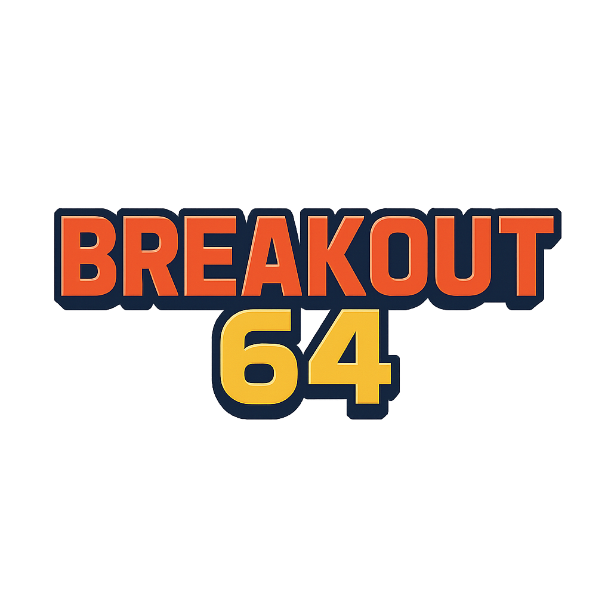

  

# Breakout 64 v0.1 - WIP

Showcase project for **Breakout 64** — a Breakout-inspired arcade game built with **PolarisKit**.

This project is part of the **Polaris Studios** game library for the M64 console.

---

## Project Overview

**Breakout 64** is my take on the classic Breakout / Brick Breaker genre:

- Fast, responsive paddle control
- Stylized retro visuals
- Dynamic sound effects and music

---

## Planned Features

✅ Core brick-breaking gameplay  
✅ Responsive controls with smooth paddle movement  
✅ Multiple levels with increasing challenge  
✅ Basic scoring system  

---

## In Progress

🟡 **Intro Scene**  
→ A simple Polaris intro sequence to match other M64 titles.

🟡 **Title Screen**  
→ Original Breakout 64 title screen with start button.

🟡 **Achievements**  
→ A small set of unlockable achievements (tracked in-game).  
Examples:
- First Break
- Clean Sweep (clear level with no missed ball)
- High Score 

🟡 **Pause Menu**  
→ Consistent with PolarisKit structure.

🟡 **Polished Game Over screen**  
→ Replay option, return to title.

---

## Version History

### v0.1 - Initial Commit (2025-06-11)
- [x] Added ReadMe
- [x] Attached Background Image

---

## Showcase Notes

This repo is for **showcase purposes only** — it will contain screenshots, GIFs, and design notes.  
The full game source code is maintained in a separate private repository.

---

## Polaris Studios

Breakout 64 is part of the Polaris Studios game lineup for my upcoming **M64 console**, alongside:

- Callisto’s Trial  
- Galactic Tour 64  
- Golden Hour  
- Pirate Cove series  
- PolarisPong  
- Studio Generations  
- and more.

---

## 🔒 Code Access

> The codebase is currently **private**.  
> This repository is a **project showcase** highlighting features, screenshots, and development direction.  
> Interested in early access or collaboration?  
> Reach out via [LinkedIn](https://www.linkedin.com/in/marco-a-gonzalez99).

---

## Built By

Marco @ **SB Studios**  
[GitHub](https://github.com/marcogonzalez99) 
[LinkedIn](https://www.linkedin.com/in/marco-a-gonzalez99)

---

*Built with PolarisKit.*  
*© Polaris Studios 2025.*